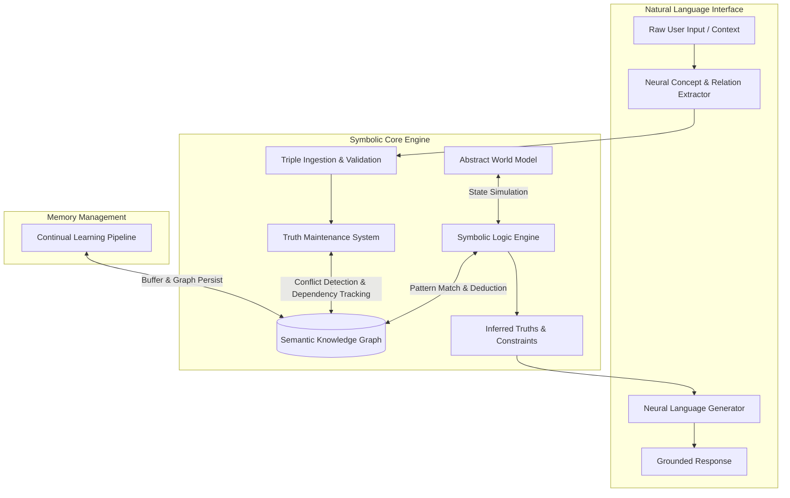

> **Status:** 🚧 *Conceptual Architecture / Work in Progress*  
> *This specification outlines the proposed design and theoretical framework for PrismAi. Components, data structures, and APIs are subject to change as prototyping progresses.*

# Neurosymbolic AI Engine (Python)

A production-ready blueprint for a hybrid, logic-first AI system. Implemented in Python, this engine fuses neural language processing with dynamic knowledge graphs, deterministic truth maintenance, symbolic logic, and continuous online learning.

---

## Overview & Design Philosophy

Standard Large Language Models (LLMs) operate as statistical pattern matchers—predicting tokens without an explicit internal representation of truth, state, or time. When facts change, an LLM cannot update its weights instantly without full fine-tuning or retraining.

This engine decouples **Language** from **Logic and Memory**:

* **Neural Front-End:** Handles messy human natural language parsing and natural generation.
* **Symbolic Core:** Handles truth, factual relationships, state consistency, temporal tracking, and deterministic reasoning.

---

## System Architecture



---

## Detailed Component Breakdown

### 1. Semantic Knowledge Graph (`knowledge_graph.py`)

Facts are represented as directed hyper-relational graphs using `NetworkX`. Each edge stores rich metadata rather than just static labels.

* **Typed Nodes:** Represent distinct entities, concepts, or temporal states.
* **Rich Edge Data:** Every relation contains a confidence metric $C \in [0.0, 1.0]$, source provenance ID, and timestamp vector.

```python
import networkx as nx
from dataclasses import dataclass, field
from datetime import datetime
from typing import Any, Optional

@dataclass
class Metadata:
    confidence: float
    source: str
    timestamp: datetime = field(default_factory=datetime.utcnow)
    evidence_ids: list[str] = field(default_factory=list)

class SemanticKnowledgeGraph:
    def __init__(self):
        self.graph = nx.MultiDiGraph()

    def add_fact(self, subject: str, predicate: str, obj: str, meta: Metadata):
        """Inserts a structured triple with attached metadata."""
        self.graph.add_node(subject, label="Entity")
        self.graph.add_node(obj, label="Entity")
        self.graph.add_edge(
            subject, 
            obj, 
            key=predicate, 
            predicate=predicate, 
            confidence=meta.confidence, 
            source=meta.source, 
            timestamp=meta.timestamp,
            evidence=meta.evidence_ids
        )

    def get_relations(self, subject: str) -> list[dict[str, Any]]:
        if not self.graph.has_node(subject):
            return []
        edges = []
        for u, v, k, data in self.graph.out_edges(subject, keys=True, data=True):
            edges.append({"subject": u, "object": v, "predicate": k, **data})
        return edges

```

---

### 2. Truth Maintenance System (`tms.py`)

Based on Doyle’s Reason Maintenance Systems (RMS) and AGM belief revision theory. Automatically resolves contradictions without wiping historical data.

* **Dependency Tracking:** Maintains explicit record of which facts depend on which premises.
* **Contradiction Management:** When a new fact directly contradicts an existing edge (e.g., `[Alex] -> [likes] -> [Cheese]` vs `[Alex] -> [dislikes] -> [Cheese]`), the TMS compares confidence scores, timestamps, and source authority to mark non-belief nodes.

```python
class TruthMaintenanceSystem:
    def __init__(self, kg: SemanticKnowledgeGraph):
        self.kg = kg

    def evaluate_and_ingest(self, subject: str, predicate: str, obj: str, meta: Metadata) -> str:
        existing = self.kg.get_relations(subject)
        
        # Check for direct antonyms/contradictions
        for edge in existing:
            if self._is_contradiction(edge['predicate'], predicate, edge['object'], obj):
                # Conflict resolution heuristic
                if meta.confidence > edge['confidence']:
                    # Retract old belief, favor new belief
                    self.kg.graph.remove_edge(edge['subject'], edge['object'], key=edge['predicate'])
                    self.kg.add_fact(subject, predicate, obj, meta)
                    return f"REVISED: Replaced belief '{edge['predicate']}' with '{predicate}' based on higher confidence."
                else:
                    return f"REJECTED: Existing belief holds higher confidence ({edge['confidence']} > {meta.confidence})."
        
        self.kg.add_fact(subject, predicate, obj, meta)
        return "INGESTED: New fact appended with zero conflicts."

    def _is_contradiction(self, pred1: str, pred2: str, obj1: str, obj2: str) -> bool:
        opposites = {("likes", "dislikes"), ("is", "is_not"), ("supports", "opposes")}
        if obj1 == obj2 and ((pred1, pred2) in opposites or (pred2, pred1) in opposites):
            return True
        return False

```

---

### 3. Symbolic Logic Engine (`logic_engine.py`)

Executes deterministic inference rules over the graph to derive new unstated facts (forward chaining) or verify queries (backward chaining).

```python
class SymbolicLogicEngine:
    def __init__(self, kg: SemanticKnowledgeGraph):
        self.kg = kg
        self.rules = []

    def register_rule(self, rule_func):
        """Registers a logic rule (e.g., If A is_a B and B lives_in C -> A lives_in C)."""
        self.rules.append(rule_func)

    def infer_new_facts(self) -> int:
        inferred_count = 0
        for rule in self.rules:
            new_triples = rule(self.kg.graph)
            for sub, pred, obj, meta in new_triples:
                if not self.kg.graph.has_edge(sub, obj, key=pred):
                    self.kg.add_fact(sub, pred, obj, meta)
                    inferred_count += 1
        return inferred_count

```

---

### 4. Abstract World Model (`world_model.py`)

Inspired by Yann LeCun's JEPA (Joint Embedding Predictive Architecture). Predicts environmental state transitions in abstract state space rather than predicting language tokens.

```python
import numpy as np

class AbstractWorldModel:
    def __init__(self, state_dim: int = 128):
        self.state_dim = state_dim
        self.current_state = np.zeros(state_dim)

    def update_state(self, symbolic_changes: list[dict]):
        """Encodes symbolic graph changes into latent state representations."""
        for change in symbolic_changes:
            # Deterministic mapping of symbolic state to latent state projection
            vector_delta = np.random.RandomState(hash(change['predicate']) % 2**32).randn(self.state_dim) * 0.1
            self.current_state += vector_delta

    def predict_action_outcome(self, action_vector: np.ndarray) -> float:
        """Predicts feasibility/stability of a hypothetical state change in representation space."""
        projected_state = self.current_state + action_vector
        stability_score = float(1.0 / (1.0 + np.linalg.norm(projected_state)))
        return stability_score

```

---

### 5. Continual Learning Pipeline (`continual_learning.py`)

Prevents **catastrophic forgetting** by bypassing standard neural weight updates for factual knowledge. Factual updates occur dynamically in the graph, while neural models remain frozen.

```python
class ContinualLearningPipeline:
    def __init__(self, kg: SemanticKnowledgeGraph, tms: TruthMaintenanceSystem):
        self.kg = kg
        self.tms = tms
        self.stream_buffer = []

    def process_stream(self, data_packet: dict):
        """Processes real-time streaming updates without requiring fine-tuning."""
        meta = Metadata(
            confidence=data_packet.get("confidence", 1.0),
            source=data_packet.get("source", "stream"),
            evidence_ids=[data_packet.get("id", "")]
        )
        status = self.tms.evaluate_and_ingest(
            subject=data_packet["sub"],
            predicate=data_packet["pred"],
            obj=data_packet["obj"],
            meta=meta
        )
        self.stream_buffer.append({"packet": data_packet, "status": status})

```

---

## Complete Pipeline Execution Example

```python
# main.py
from datetime import datetime

# Initialize Core System
kg = SemanticKnowledgeGraph()
tms = TruthMaintenanceSystem(kg)
logic = SymbolicLogicEngine(kg)
pipeline = ContinualLearningPipeline(kg, tms)

# 1. Ingest Base Facts
print("--- Step 1: Base Data Ingestion ---")
res1 = tms.evaluate_and_ingest("Alex", "likes", "Pizza", Metadata(confidence=0.9, source="user_pref"))
res2 = tms.evaluate_and_ingest("Pizza", "contains", "Cheese", Metadata(confidence=0.99, source="fact_db"))
print(res1)
print(res2)

# 2. Ingest Contradictory Inbound Stream
print("\n--- Step 2: Handling Contradiction ---")
res3 = tms.evaluate_and_ingest("Alex", "dislikes", "Pizza", Metadata(confidence=0.95, source="recent_survey"))
print(res3)  # Replaces 'likes' with 'dislikes' due to higher confidence (0.95 > 0.90)

# 3. Query Graph State
print("\n--- Step 3: Current Graph Memory ---")
print("Alex's Current State:", kg.get_relations("Alex"))

```

---

## Theoretical Foundations & Historical References

| Component | Historical Inspiration / Paper | Solved Problem |
| --- | --- | --- |
| **Knowledge Graphs** | M. Ross Quillian (1968) / Wikidata / Cyc | Replaces implicit neural memory with explicit, verifiable relational structures. |
| **Truth Maintenance** | Jon Doyle (1979) / AGM Theory (1985) | Solves memory rigidity by enabling real-time belief revision without retraining. |
| **Cognitive Architectures** | SOAR (Laird et al.) / OpenCog AtomSpace | Uses working memory and explicit production rules for deterministic reasoning. |
| **World Models** | Yann LeCun (Meta JEPA) | Replaces token prediction with continuous state prediction in abstract feature spaces. |
| **Neurosymbolic Bridge** | Garcez et al. / Marcus (2020) | Combines LLM language comprehension with symbolic logical accuracy. |

---

## Installation & Quickstart

```bash
# Clone repository
git clone https://github.com/your-u/neurosymbolic-ai-engine.git
cd neurosymbolic-ai-engine

# Create virtual environment
python -m venv venv
source venv/bin/activate  # On Windows: venv\Scripts\activate

# Install dependencies
pip install networkx numpy

```
