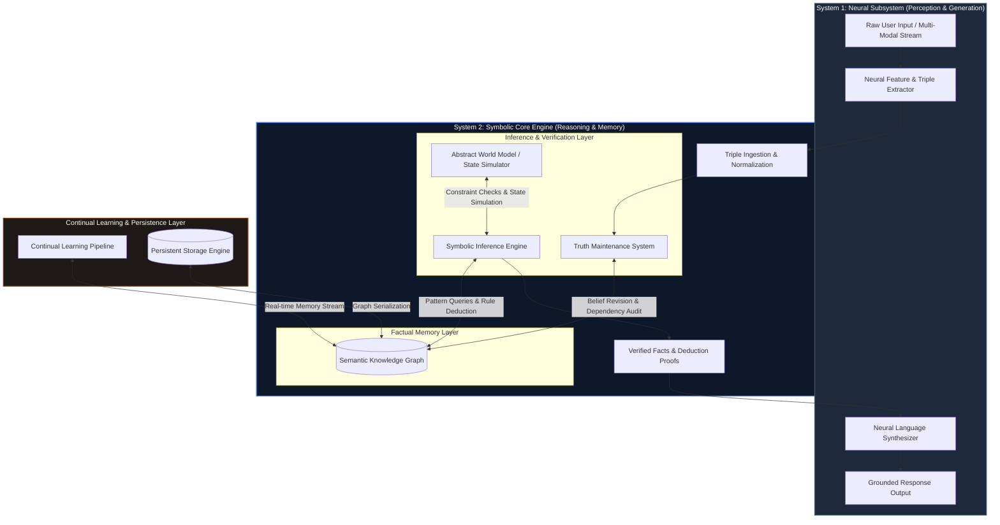
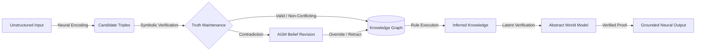
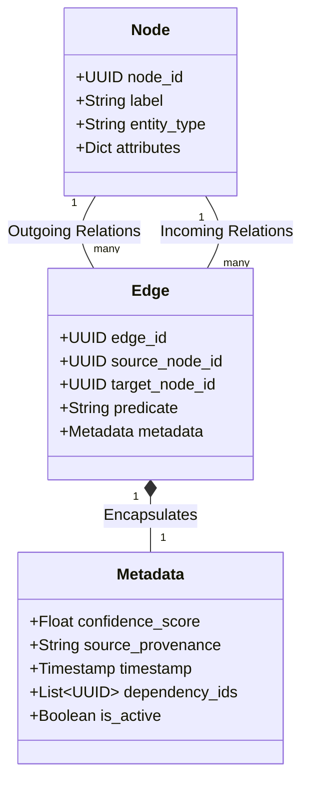
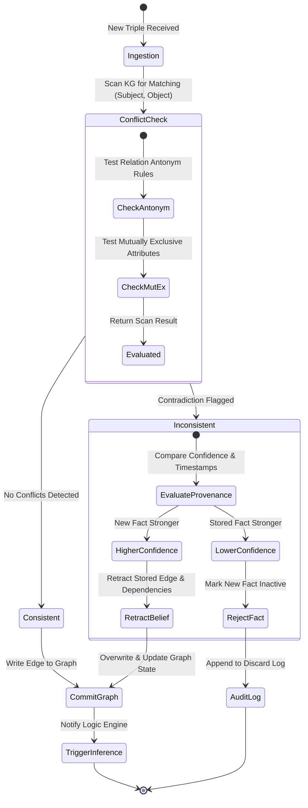
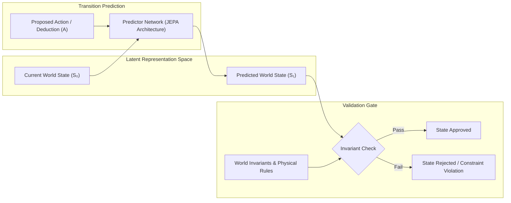
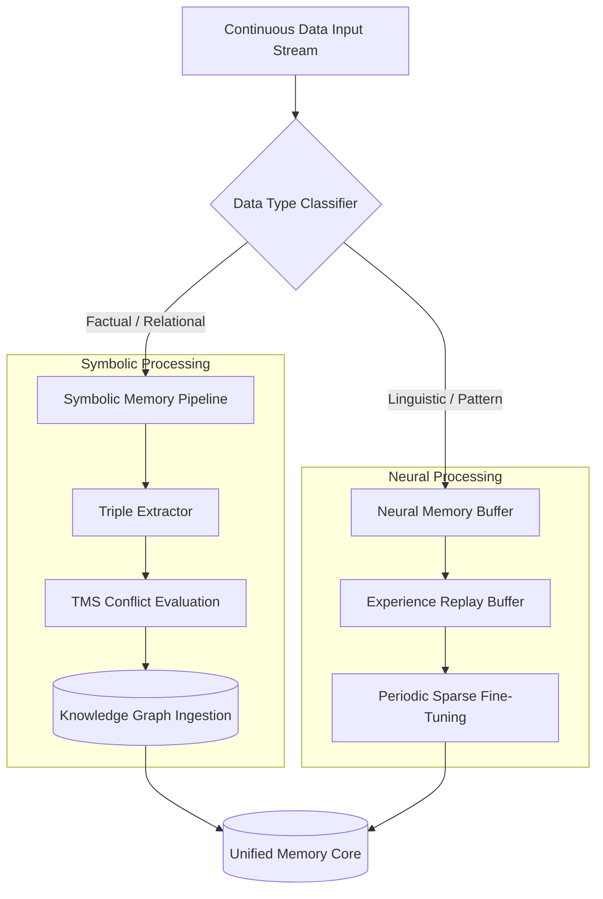

> **Author Note:** AI helped me write, format, and structure this description because I am a dyslexic student. I have built an early working prototype of this system, and this document explains how the prototype is designed and where the project is heading.

# Neurosymbolic AI Engine

> **Status:** 🧪 *Working Prototype / Evolving Architecture*  
> *A dual-process (System 1 / System 2) hybrid AI architecture combining neural language capabilities with deterministic symbolic logic, continuous truth maintenance, abstract world modeling, and persistent factual memory.*

---

## 1. System Vision & Architecture

Standard Large Language Models (LLMs) operate strictly as statistical next-token predictors. Because factual knowledge is frozen inside dense parameter weights, LLMs struggle with hallucinations, real-time factual updates, multi-step logic, and persistent state tracking.

This project decouples **Language Comprehension** (Neural Subsystem) from **Logic, Memory, and Truth** (Symbolic Subsystem).

### 1.1 Prototype State vs. Target Blueprint

* **Current Prototype Capabilities:** The active code prototype successfully extracts candidate triples from text, ingests them into a graph structure (`NetworkX`), runs basic Truth Maintenance System (TMS) conflict resolution in Python, and handles dynamic belief updates without model retraining.
* **Target Architecture:** Scaling the prototype into a production pipeline with custom continuous learning layers, latent space world models (JEPA-inspired), and hybrid neurosymbolic query generation.

### 1.2 Architecture Flow

---

## 2. Core Subsystem Specifications

### 2.1 Dual-Process Information Pipeline

---

### 2.2 Semantic Knowledge Graph Schema

Factual memory is represented as a graph with nodes (entities) and directed edges (relationships). Each edge stores:

* **Confidence Score** — How certain we are the fact is true (0-1 scale)
* **Source** — Where this fact came from (user input, inference, etc.)
* **Timestamp** — When it was added or updated
* **Dependencies** — Which other facts depend on this one
* **Active Status** — Whether this fact is currently in use or has been retracted

---

### 2.3 Truth Maintenance System (TMS) State Machine

The TMS tracks facts and handles contradictions automatically. When a new fact comes in:

1. **Conflict Check** — Does this fact contradict anything already stored?
2. **Evaluate Evidence** — Which version is more trustworthy? (higher confidence wins)
3. **Update Graph** — Accept the stronger fact and remove the weaker one
4. **Cascade Changes** — Update any other facts that depend on it

---

### 2.4 End-to-End Execution Sequence Flow

This sequence details how a prompt containing contradictory or updated information flows through the engine to produce a verified response.

```mermaid
sequenceDiagram
    autonumber
    actor User as User / External API
    participant NL as Neural Interface (Parse/Gen)
    participant TMS as Truth Maintenance System
    participant KG as Semantic Knowledge Graph
    participant Logic as Symbolic Logic Engine
    participant WM as Abstract World Model

    User->>NL: Input: "Alex switched to a vegan diet."
    NL->>TMS: Extract Triple: (Alex, follows_diet, Vegan)
    TMS->>KG: Query existing relations for (Alex, follows_diet, *)
    KG-->>TMS: Return: (Alex, follows_diet, Omnivore) [Conf: 0.85, Time: t-1]

    rect rgb(30, 41, 59)
        note over TMS,KG: Conflict Resolution Protocol
        TMS->>TMS: Evaluate Metadata: New Conf (0.95) > Stored Conf (0.85)
        TMS->>KG: Retract Edge: (Alex, follows_diet, Omnivore)
        TMS->>KG: Invalidate Downstream Inferences: (Alex, eats, Meat)
        TMS->>KG: Commit Edge: (Alex, follows_diet, Vegan) [Conf: 0.95, Time: t-0]
    end

    TMS->>Logic: Trigger Forward-Chaining Inference
    Logic->>KG: Fetch Rules matching "follows_diet: Vegan"
    Logic->>KG: Deduce New Rule: (Alex, dislikes, Meat)
    Logic->>WM: Validate Inferred State in Latent Representation Space
    WM-->>Logic: State Validation Passed (Stability Score: 0.98)
    Logic->>KG: Commit Verified Inference: (Alex, dislikes, Meat)

    Logic->>NL: Pass Deductive Proof Tree & State Constraints
    NL-->>User: Output: "Updated Alex's profile to vegan. Inferred that Alex avoids meat products."
```

---

### 2.5 Abstract World Model Transition Dynamics

The Abstract World Model models conceptual and physical transition dynamics in representation space, ensuring logical inferences adhere to world constraints.

---

### 2.6 Continual Learning & Memory Stream Routing

---

## 3. How the Belief Revision Works

When a new fact comes in that conflicts with what's already stored, the system decides which one to keep based on **confidence scores**:

* If the new fact has a **higher confidence** than the stored one → accept the new fact and remove the old one
* If the stored fact has a **higher confidence** → reject the new fact
* The system then updates any other facts that depend on the one that changed (called "cascading updates")

**Important Note:** Confidence scores from different sources (like a neural language model vs. human input) might not be directly comparable. In real use, the system would need to calibrate these scores first.

---

## 4. Architectural Comparison

| Capability | Standard Token LLMs | Classic Symbolic Systems | This Engine |
| --- | --- | --- | --- |
| **Language Processing** | Native / High | Non-Existent / Rigid | **Neural Front-End (Fluent)** |
| **Fact Storage** | Implicit Weight Matrices | Explicit Static Rulebases | **Dynamic Attributed Multi-Graph** |
| **Belief Revision** | Requires Retraining / Fine-Tuning | Manual Database Overwrite | **Real-time Automated TMS** |
| **Hallucination Rate** | High (Unbounded) | Minimal | **Reduced (Graph-Grounded, but depends on extraction quality)** |
| **Logical Inference** | Probabilistic Pattern Matching | Deterministic Deduction | **Deterministic Forward/Backward Chaining** |
| **State Tracking** | Context Window Dependent | Structural Dependency Graphs | **Latent World Model & Graph Persistence** |
